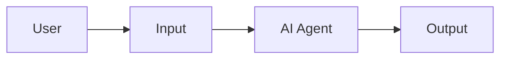
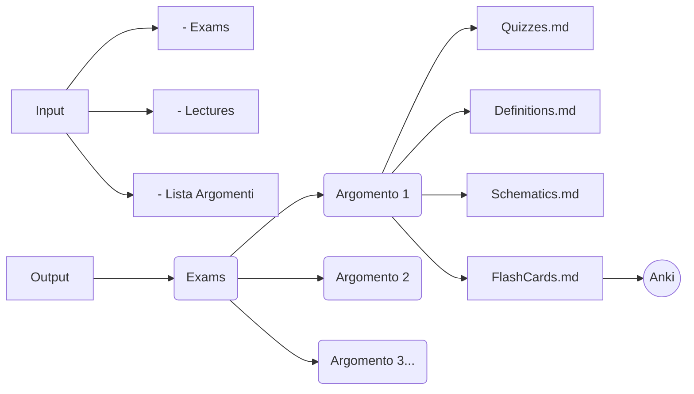
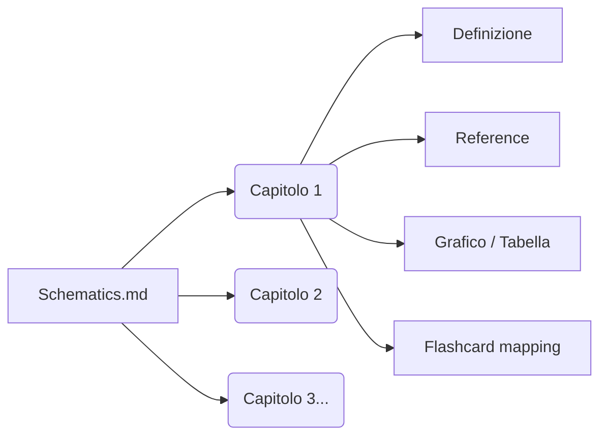
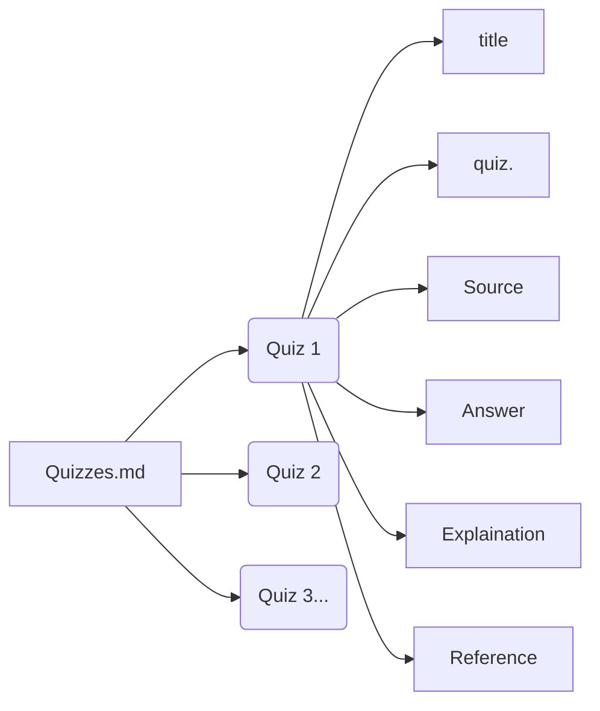
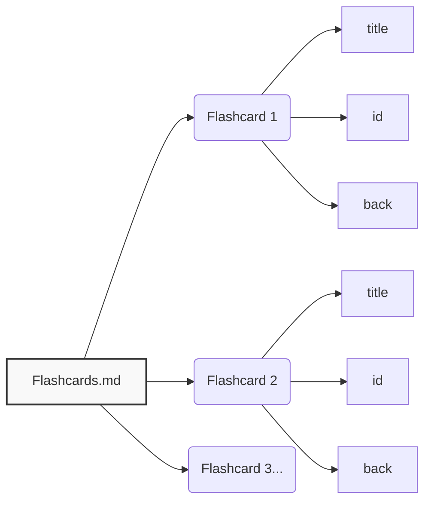

# Exam Schematizer Skill — AI-Powered Study Workflow for Anki Flashcards, Quizzes & Lecture Notes

**Transform your exam PDFs and lecture slides into structured study materials** — organized by topic (argomento) and chapter (capitolo). Generate **Anki flashcards**, **quiz questions with answers**, **definitions**, and **concept schematics** automatically using AI agents.

This [OpenCode](https://opencode.ai) skill gives any AI coding agent a repeatable workflow to analyze university course materials, extract key concepts, and produce structured Markdown outputs ready for spaced repetition with Anki.

> 🇮🇹 Ottimizzato per l'organizzazione di corsi universitari italiani: esami, lezioni, argomenti e capitoli.

---

## Key Features

- **Anki Flashcard Generator** — Creates structured flashcards with unique IDs, front/back format, ready for AnkiConnect sync
- **Quiz Extraction from Exams** — Parses past exam PDFs and extracts questions with answers, explanations, and source references
- **Lecture Schematics** — Builds concept maps organized by chapter with definitions, references, and diagrams (Mermaid or slide screenshots)
- **Topic & Chapter Progress Tracking** — Checkbox-based progress system tracking what you've studied, memorized (via Anki), and tested
- **Flashcard Gating** — Only exports flashcards to Anki for topics you've marked as studied, preventing card overload
- **Mermaid Diagrams** — Auto-generates tree diagrams (max 3 levels) in schematics, split into 2-level flashcards
- **Course Structure** — Supports any course hierarchy: Course → Topics (Argomenti) → Chapters (Capitoli)
- **OCR Support** — Handles scanned PDFs via Tesseract or EasyOCR

---

## How It Works

```
You provide:      Past exam PDFs + Lecture slides + List of topics
AI Agent does:    Analyzes materials → Extracts concepts → Structures by chapter
You get:          Quizzes.md + Definitions.md + Schematics.md + Flashcards.md
```

### Step-by-Step Workflow

1. **Create the project structure**: The skill sets up `Input/`, `Output/`, and `Progress/` folders along with a `Sommario.md` course index.
2. **Provide your materials**: Place exam PDFs in `Input/Exams/` and lecture slides in `Input/Lectures/`.
3. **List your topics**: Tell the AI your course's **Argomenti** (topics). The chapters are automatically discovered from the materials.
4. **AI processes each topic**: For every argomento, the AI identifies its chapters from the lecture PDFs, then for each chapter generates:
   - **Quizzes.md** — Exam questions with answers, explanations, and page references
   - **Definitions.md** — Key definitions matching lecture slide text
   - **Schematics.md** — Concept diagrams divided by chapter (top-down order, max 3 levels deep)
   - **Flashcards.md** — Anki-ready cards with title, unique ID, and back content
5. **Track progress**: Mark topics as *Studiato* (studied), *Memorizzato* (memorized — auto-detected from Anki), and *Tested*.
6. **Export to Anki**: Only flashcards for studied topics are exported via AnkiConnect — no card flooding.
7. **Review & repeat**: Complete quizzes, review Anki cards, and progress to the next topic.

---

## Diagrams

### General Workflow



The AI agent receives course materials (PDFs) and a list of topics, then outputs structured study files.

### Input / Output Flow



**Input**: Exam PDFs, lecture slides, and a list of argomenti (topics).  
**Output**: One folder per argomento, each containing four Markdown files.  
**Destination**: Flashcards are exported to Anki for spaced repetition.

### Schematics Structure (by Chapter)



Each schematics file is divided by **chapters** (not generic elements). For each chapter: definition, source reference, diagram (from slides or Mermaid-generated), and flashcard cross-reference.

### Quizzes Structure



Each quiz entry includes: title, question text, source file, correct answer, explanation, and page reference.

### Flashcards Structure



Flashcards follow Anki's standard front/back format with unique IDs for deduplication.

---

## Folder Structure

```
Input/
  Exams/          ← Place your exam PDFs here
  Lectures/       ← Place your lecture slides here

Output/
  Exams/
    <Argomento 1>/
      Quizzes.md
      Definitions.md
      Schematics.md
      Flashcards.md
    <Argomento 2>/
      ...

Progress/       ← Per-topic chapter checklists
Progress.md     ← Master checklist (topics)
Sommario.md     ← Course index
```

---

## Progress Tracking

Two checklist files track your study progress with three fields per item:

| Field | Who marks it | Description |
|---|---|---|
| **Studiato** | User (manually) | You've finished studying this topic/chapter |
| **Memorizzato** | AI agent (auto from Anki) | Cards have matured in Anki reviews |
| **Testing** | User (manually) | You've completed the related quizzes |

- **Progress.md** — Master checklist: one entry per argomento
- **Progress/\<Argomento\>.md** — Chapter checklist: one entry per capitolo within that argomento

### Flashcard Gating

Flashcards are **only exported to Anki** for topics you've marked as *Studiato*. This prevents Anki overload from unreviewed material.

---

## Dependencies

- [Anki](https://apps.ankiweb.net) + [AnkiConnect](https://ankiweb.net/shared/info/2055492159) — for automated flashcard sync
- [Tesseract OCR](https://github.com/tesseract-ocr/tesseract) or [EasyOCR](https://github.com/JaidedAI/EasyOCR) — for scanned PDFs
- [OpenCode CLI](https://opencode.ai) — to run this skill with any AI agent
- [mermaid-export](https://opencode.ai) — (optional) to render diagrams as PNG/SVG

---

## Getting Started

```bash
# 1. Make sure OpenCode is installed
# 2. Install this skill globally:
cp -r exam-schematizer ~/.config/opencode/skills/exam-schematizer/
# 3. In any OpenCode session, the agent will auto-detect when to use it
```

Or install directly from GitHub:
```bash
git clone https://github.com/P0rkoTh10/Exam-Schematizer-Skill.git
# Copy SKILL.md to your global skills directory
```

---

## Use Cases

- **University students** preparing for exams with past papers and lecture slides
- **Medical students** managing large volumes of course content with Anki
- **Self-study** — Organize any course materials into structured, reviewable formats
- **Study groups** — Share organized schematics and quiz collections

---

## Related Projects

- [anki-llm-prompt-engineering](https://github.com/frederik-hoeft/anki-llm-prompt-engineering) — LLM prompts for generating Anki flashcards from lecture PDFs
- [awesome-opencode-skills](https://github.com/TheArchitectit/awesome-opencode-skills) — Curated collection of OpenCode skills
- [opencode-skill-creator](https://github.com/antongulin/opencode-skill-creator) — Create, test and optimize OpenCode skills
- [agent-skills](https://github.com/addyosmani/agent-skills) — Large collection of reusable agent skills
- [Flashcards-Data-Formatting](https://github.com/Jinko11/Flashcards-Data-Formatting) — Convert lecture content to Anki JSONL format

---

## Topics

`anki` `anki-flashcards` `anki-connect` `exam-preparation` `study-tool` `opencode` `opencode-skill` `flashcard-generator` `quiz-generator` `lecture-notes` `schematizer` `spaced-repetition` `ai-study-assistant` `pdf-to-flashcards` `university-exams`
