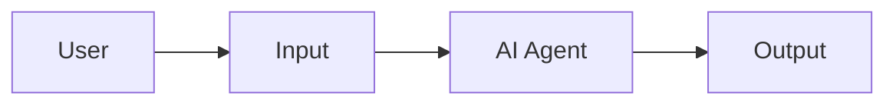
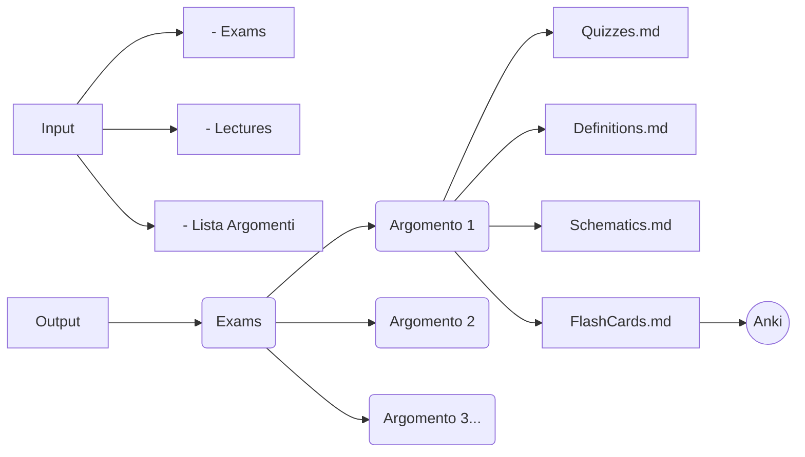
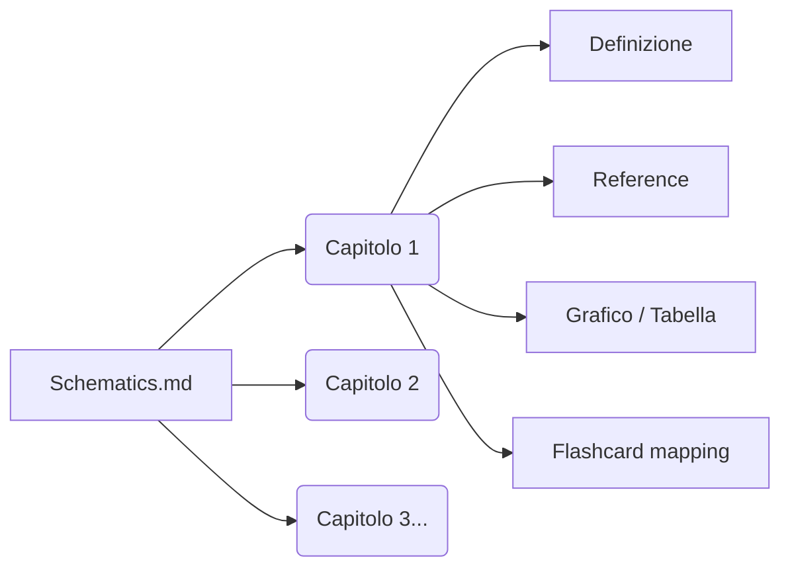
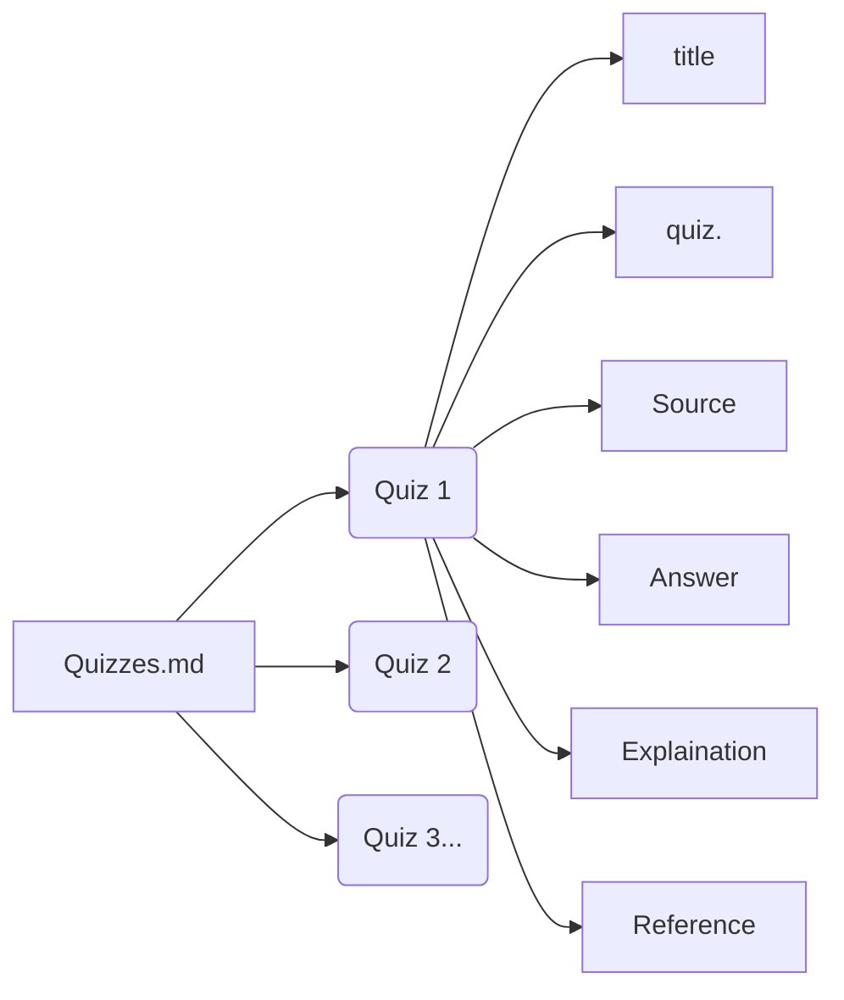
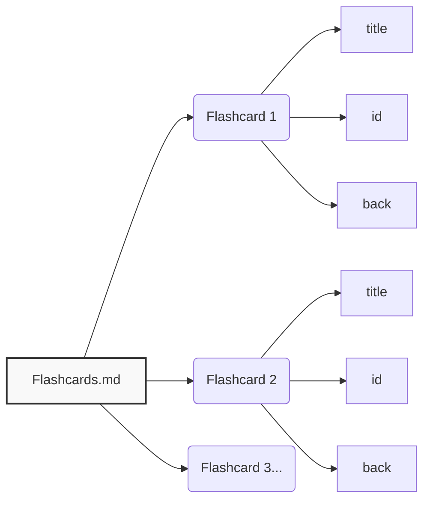

# Exam Schematizer Skill

Workflow riutilizzabile per categorizzare e schematizzare esami e lezioni di un corso.  
Il corso è diviso in **Argomenti** (topics), ciascuno contenente **Capitoli** (chapters).  
Output strutturato per argomento: **Quiz**, **Definizioni**, **Schemi** e **Flashcard**, con riferimenti tracciabili.

---

## Workflow Generale



| Elemento | Descrizione |
|---|---|
| **User** | L'utente fornisce i materiali (exams, lectures) e la lista degli argomenti |
| **Input** | Materiali grezzi: Exams, Lectures, Lista Argomenti |
| **AI Agent** | Analizza, categorizza e produce gli output strutturati |
| **Output** | File markdown organizzati per argomento |

---

## Input / Output



| Elemento | Descrizione |
|---|---|
| **Exams** | Cartella `Input/Exams/` con i PDF degli esami |
| **Lectures** | Cartella `Input/Lectures/` con i PDF delle lezioni |
| **Lista Argomenti** | Elenco degli argomenti del corso fornito dall'utente in chat |
| **Exams (Output)** | Cartella `Output/Exams/` organizzata per argomento |
| **Argomento N** | Sottocartella per ogni argomento del corso |
| **Quizzes.md** | Quiz tratti da esami e lezioni, con risposte e spiegazioni |
| **Definitions.md** | Definizioni testuali tratte dalle slide delle lezioni |
| **Schematics.md** | Schemi concettuali divisi per capitoli |
| **FlashCards.md** | Flashcard pronte per l'esportazione su Anki |
| **Anki** | Destinazione finale delle flashcard (tramite AnkiConnect) |

---

## Struttura Schematics.md



| Elemento | Descrizione |
|---|---|
| **Capitolo N** | Suddivisione interna dello schema per capitoli |
| **Definizione** | Spiegazione del concetto chiave |
| **Reference** | Riferimento alla slide di origine (`Lectures/file.pdf`, p. X) |
| **Grafico / Tabella** | Immagine copiata dalle slide o diagramma generato via Mermaid |
| **Flashcard mapping** | Collegamento alle flashcard corrispondenti |

---

## Struttura Quizzes.md



| Elemento | Descrizione |
|---|---|
| **Quiz N** | Singolo quiz estratto da esami o lezioni |
| **title** | Titolo del quiz |
| **quiz.** | Testo della domanda |
| **Source** | File di origine (esame o lezione) |
| **Answer** | Risposta corretta |
| **Explaination** | Spiegazione della risposta |
| **Reference** | Pagina di riferimento |

---

## Struttura Flashcards.md



| Elemento | Descrizione |
|---|---|
| **Flashcard N** | Singola carta per Anki |
| **title** | Fronte della flashcard |
| **id** | Identificativo univoco |
| **back** | Retro della flashcard (risposta) |

---

## Struttura delle Cartelle

```
Input/
  Exams/
  Lectures/

Output/
  Exams/
    <Argomento 1>/
      Quizzes.md
      Definitions.md
      Schematics.md
      Flashcards.md
    <Argomento 2>/
      ...
```

---

## Dipendenze Esterne

- **Anki + AnkiConnect** per sincronizzare flashcard automaticamente
- **OCR tool** per PDF scansionati (Tesseract o EasyOCR)

## Skill Companion

- [mermaid-export](https://opencode.ai) — per esportare diagrammi in PNG/SVG/PDF
- [anki](https://opencode.ai) — per creare/verificare flashcard Anki
