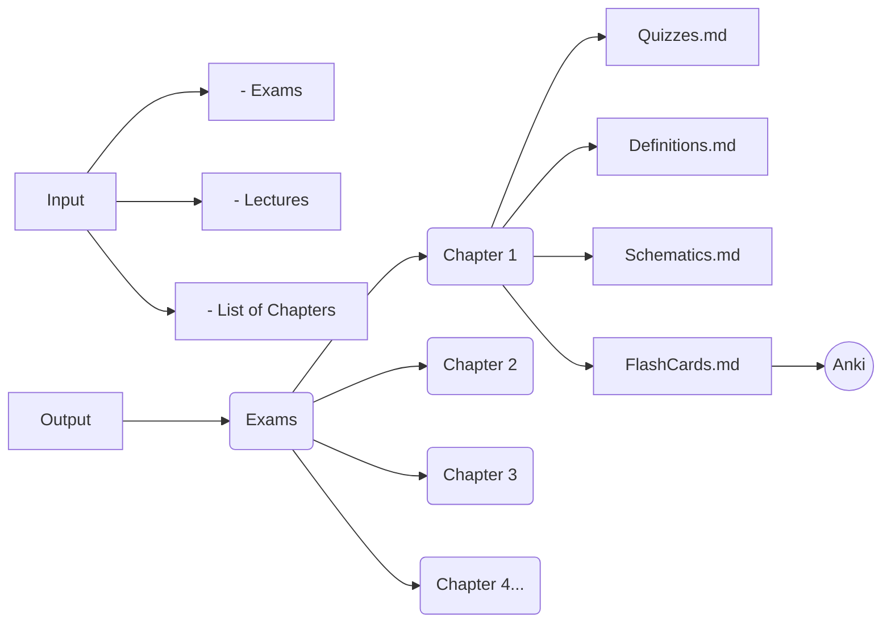
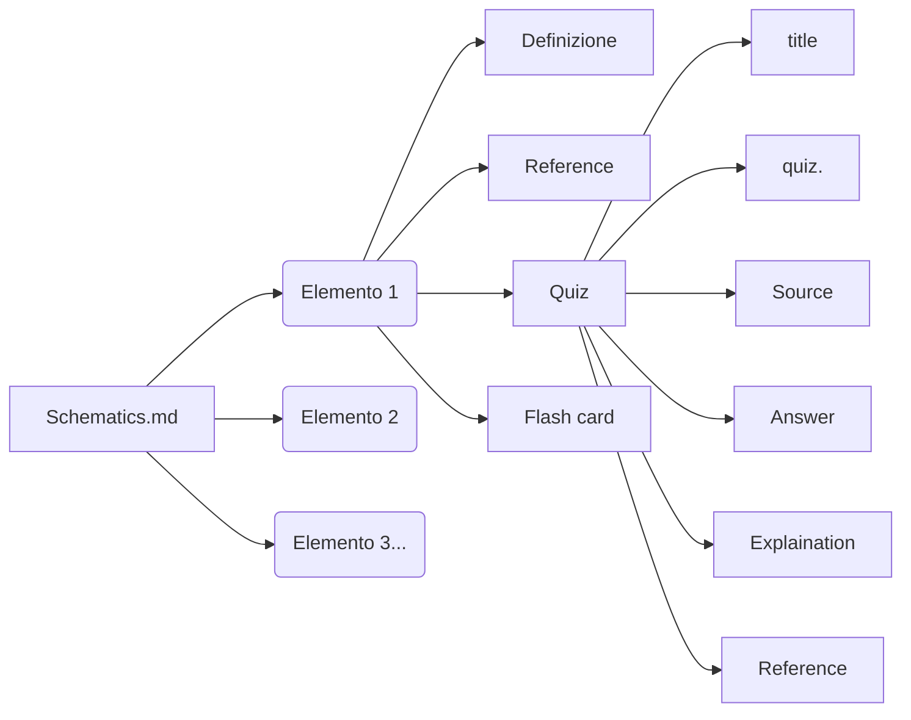
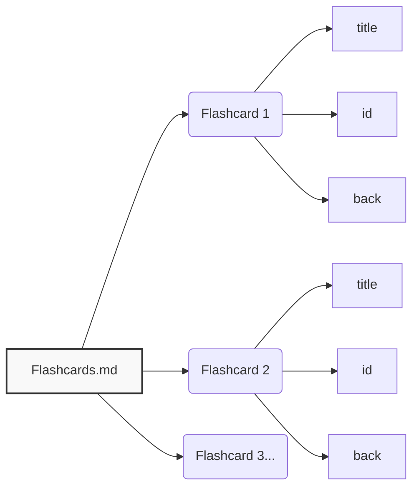

# Exam Schematizer Skill

Workflow riutilizzabile per categorizzare e schematizzare esami e lezioni di un corso in output strutturati per capitolo: **Quiz**, **Definizioni**, **Schemi** e **Flashcard**, con riferimenti tracciabili.

---

## Workflow Generale


## Flusso Input/Output



## Struttura degli Schemi (Schematics.md)



## Struttura dei Flashcard (Flashcards.md)



---

## Struttura delle Cartelle

```
Input/
  Exams/
  Lectures/

Output/
  Exams/
    <Chapter 1>/
      Quizzes.md
      Definitions.md
      Schematics.md
      Flashcards.md
    <Chapter 2>/
      ...
```

## Dipendenze Esterne

- **Anki + AnkiConnect** per sincronizzare flashcard automaticamente
- **OCR tool** per PDF scansionati (Tesseract o EasyOCR)

## Skill Companion

- [mermaid-export](https://opencode.ai) — per esportare diagrammi in PNG/SVG/PDF
- [anki](https://opencode.ai) — per creare/verificare flashcard Anki
