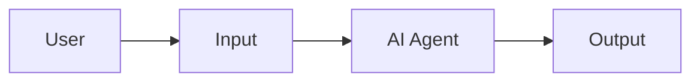
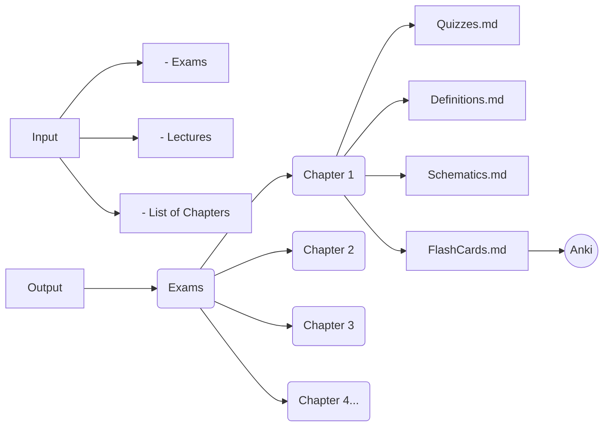
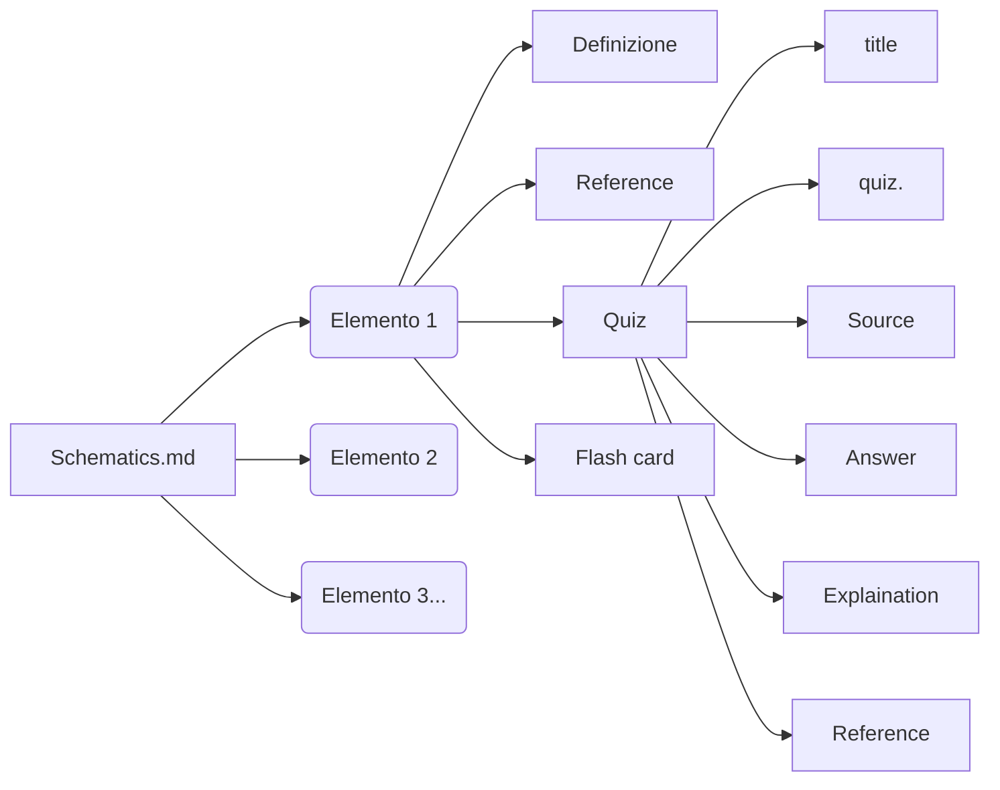
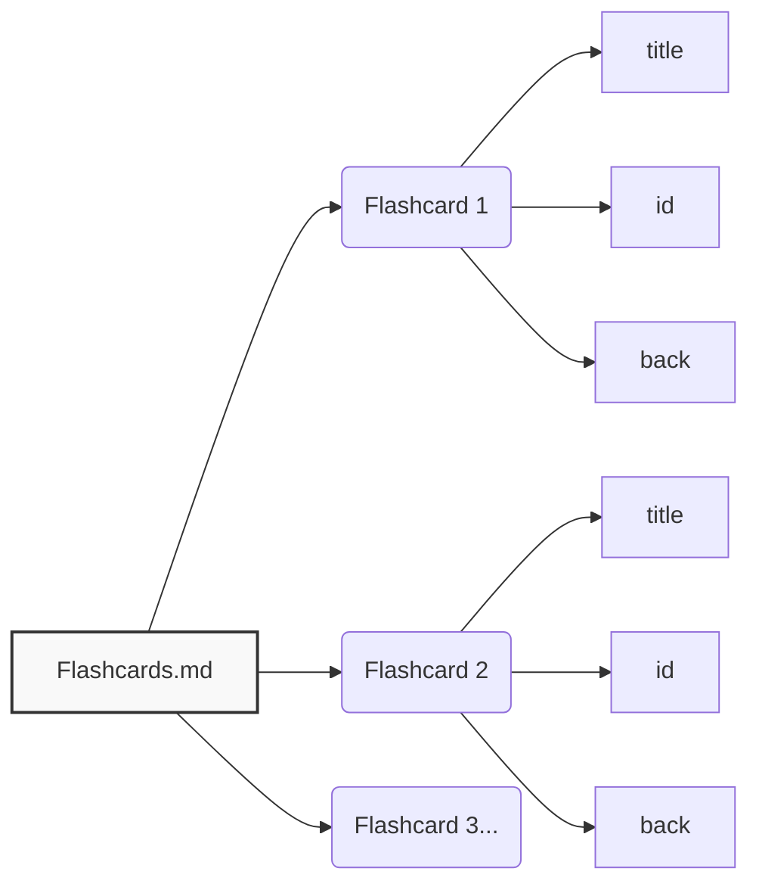

# Exam Schematizer Skill

Create a repeatable workflow to categorize and schematize a generic course’s exams and lectures into structured chapter outputs (Quizzes, Definitions, Schematics, Flashcards), with traceable references to quizzes or lecture slides.

## When to Use
- User asks to organize exam/lecture collections into chapters.
- User wants a reusable workflow like the one in this project.
- User asks for a skill to create Inputs/Outputs, maps, or flashcards.

## Required Workflow (Mermaid)









## First Run Behavior
1. Create empty folders `Input/` and `Output/` in the project root.
2. Ask the user to fill `Input/Exams/` and `Input/Lectures/`.
3. Ask the user for the **List of Chapters** (text list via chat).
4. Only proceed after the list of chapters is provided.

## Input/Output Structures

### Input
```
Input/
  Exams/
  Lectures/
```

### Output
```
Output/
  Exams/
    <Chapter 1>/
      Quizzes.md
      Definitions.md
      Schematics.md
      Flashcards.md
    <Chapter 2>/
      ...
```

## File Content Rules
### Schematics.md
- The order does **not** have to follow the slides exactly; use a **top-down conceptual** order.
- Each element must include:
  - Definition — also include a **graph/table** if it helps clarify or simplify the concept. If a graph already exists in the lecture slides, copy the **image** directly. If it doesn't exist, generate it via Mermaid.
  - Reference (lecture or quiz)
  - Quiz mapping (if applicable)
  - Flashcard mapping
- **No invented content.** Every statement must be traceable to **quiz** or **lecture slides**.
- Prefer explicit references in the format: `Lectures\file.pdf`, p. X (or `Exams\file.pdf`, p. X).
- **Tree diagrams must not exceed 3 levels.** If a concept requires more depth, split it into separate diagrams.

### Quizzes.md
- Each quiz entry should include:
  - Title
  - Quiz text
  - Source (file)
  - Answer
  - Explanation
  - Reference (page)

### Definitions.md
- Definition text must match lecture slides.
- Always add references.

### Flashcards.md
- Each card requires:
  - title
  - id (unique)
  - back (answer text)
- Keep flashcards aligned with definitions and schematics.
- **Split deep tree diagrams into separate flashcards with only 2 levels each.**
  Example — given a full diagram:
  ```
  A → {A.1 → {A.1.1, A.1.2}, A.2 → {A.2.1, A.2.2}}
  ```
  Produce 3 distinct flashcards:
  ```
  Flashcard 1: A → {A.1, A.2}
  Flashcard 2: A.1 → {A.1.1, A.1.2}
  Flashcard 3: A.2 → {A.2.1, A.2.2}
  ```

## Progress Tracking Checklist

Maintain a progress checklist in the project root (`Progress.md`) with two levels:

### Master Checkbox (per Argomento)
```
## [ ] Argomento 1  —  Studiato: [ ]  Memorizzato: [ ]  Testing: [ ]
## [ ] Argomento 2  —  Studiato: [ ]  Memorizzato: [ ]  Testing: [ ]
```

### Chapter Checkbox (per Capitolo, dentro ogni Argomento)
```
### Argomento 1
- [ ] Capitolo 1.1  —  Studiato: [ ]  Memorizzato: [ ]  Testing: [ ]
- [ ] Capitolo 1.2  —  Studiato: [ ]  Memorizzato: [ ]  Testing: [ ]
```

### Tracked Fields
- **Studiato** [ ] — marked by the **user** manually when they finish studying a topic/chapter.
- **Memorizzato** [ ] — marked by the **AI agent** after verifying retention via Anki (card maturity/ reviews).
- **Testing** [ ] — marked when the user has completed the related quizzes with satisfactory results.

### Flashcard Gating
- **Do not export flashcards to Anki for topics the user has not marked as Studiato.**
- Only generate and sync flashcards for chapters where `Studiato = [x]`. This prevents flooding Anki with cards for material the user hasn't reviewed yet.

## Tools and Companion Skills
- Use **mermaid-export** to render and export diagrams.
- Use **anki** skill to create/verify Anki flashcards.
- If PDFs are scanned, use OCR (Tesseract/EasyOCR). Ask the user to install if missing.

## External Dependencies (Inform at First Execution)
- **Anki + AnkiConnect** required for automated Anki sync.
- **OCR tool** required for scanned PDFs:
  - Tesseract (recommended) or EasyOCR

## Operating Steps (Checklist)
1. Ask for chapter list (text in chat).
2. Create `Input/`, `Output/` folders and `Progress.md`.
3. Build the **master checklist** in `Progress.md` grouped by topics from the chapter list.
4. For each chapter:
   - Identify relevant lecture PDFs and exam pages.
   - Extract definitions and quiz items.
   - Build Quizzes.md, Definitions.md, Schematics.md, Flashcards.md.
   - Ensure every concept is referenced to a quiz or slide.
5. Validate cross-mapping:
   - Each definition has at least one flashcard.
   - Schematics include references + quiz mapping + flashcard mapping.
6. **Flashcard gating**: ask the user which topics they have **Studiato**. Only generate/export flashcards to Anki for those topics.
7. After Anki sync, mark **Memorizzato** for cards that have matured.
8. As the user completes quizzes, mark **Testing**.
9. Repeat steps 4–8 for each new chapter as the user progresses.

## Notes
- The **List of Chapters** is always user-provided in chat.
- Do not proceed without that list.
- Keep file naming and casing consistent with the course’s folder conventions.
