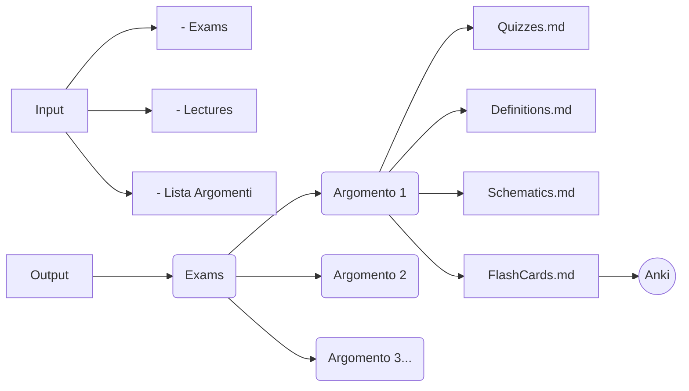
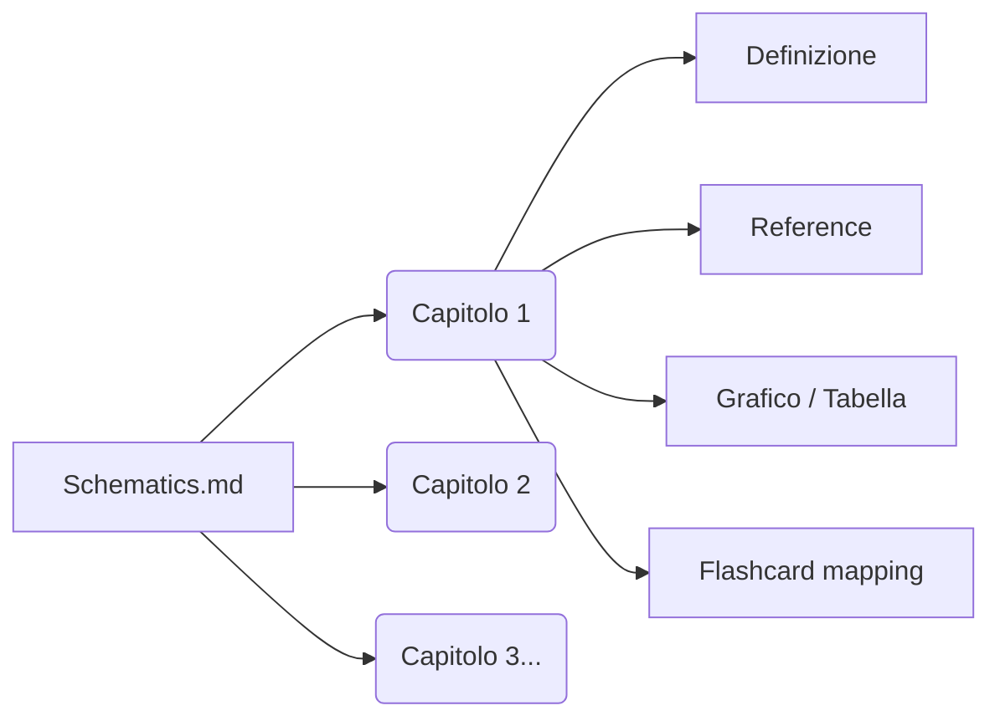
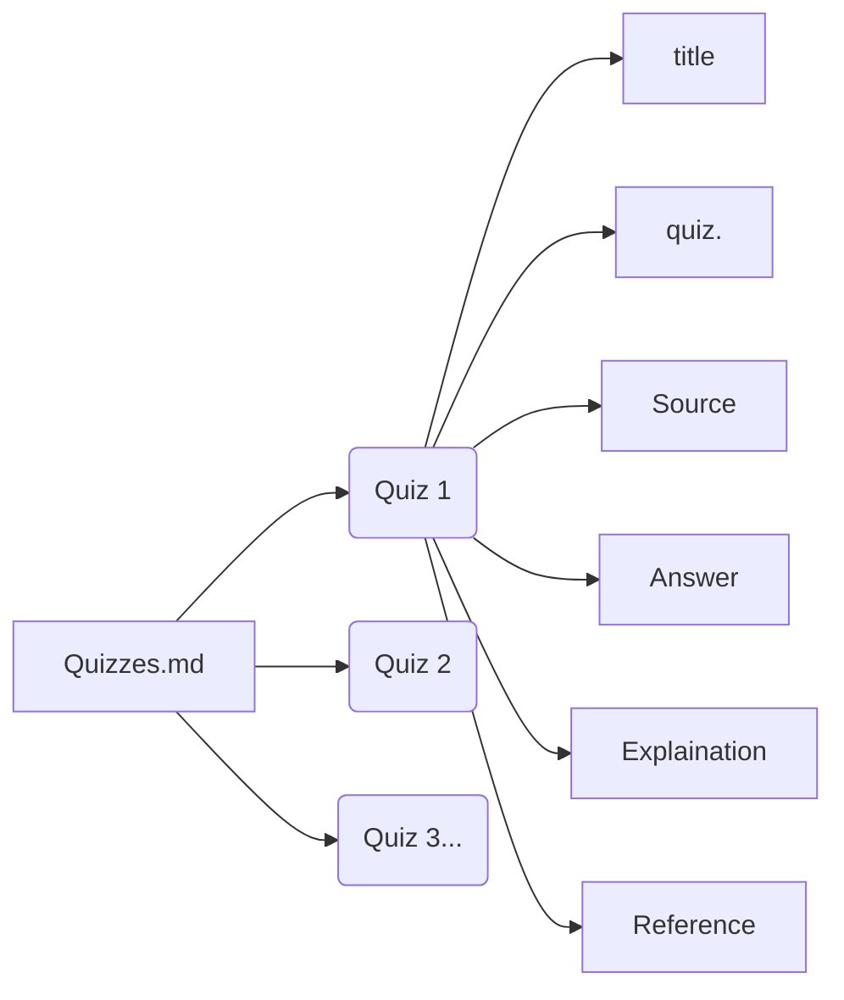
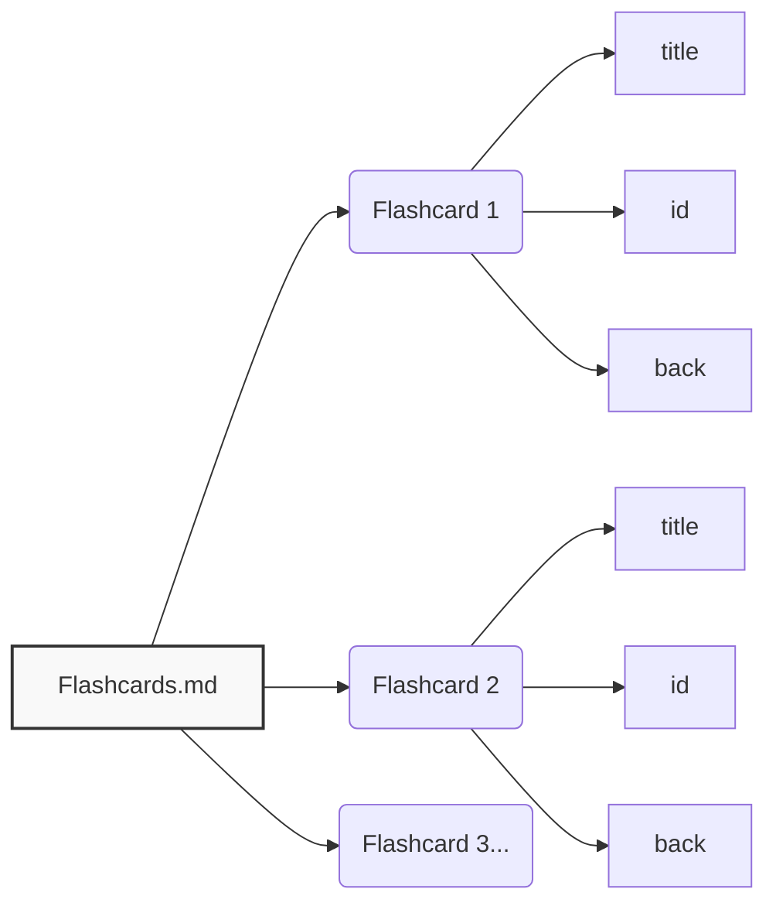

# Exam Schematizer Skill

Create a repeatable workflow to categorize and schematize a generic course’s exams and lectures. The course is divided into **Argomenti** (topics), each containing **Capitoli** (chapters). Output is structured per argomento (Quizzes, Definitions, Schematics, Flashcards), with internal division by capitoli and traceable references to quizzes or lecture slides.

## When to Use
- User asks to organize exam/lecture collections by argomento, with internal division by capitoli.
- User wants a reusable workflow like the one in this project.
- User asks for a skill to create Inputs/Outputs, maps, or flashcards.

## Required Workflow

### Generale


### Input / Output



### Struttura Schematics.md



### Struttura Quizzes.md



### Struttura Flashcards.md



## First Run Behavior
1. Create empty folders `Input/` and `Output/` in the project root.
2. Ask the user to fill `Input/Exams/` and `Input/Lectures/`.
3. Ask the user for the **list of Argomenti** (topics). Capitoli are extracted later from the lecture materials.
   - Example: `Argomento 1, Argomento 2, Argomento 3`
4. Only proceed after the argomenti list is provided.
5. Create a **`Sommario.md`** in the project root that indexes all argomenti. Capitoli are added as they are discovered from the materials.
   ```
   # Sommario — <Nome Corso>

   - [ ] **Argomento 1**
     - [ ] Capitolo 1.1   <!-- discovered from lectures -->
     - [ ] Capitolo 1.2
   - [ ] **Argomento 2**
     - [ ] Capitolo 2.1
   ```

## Input/Output Structures

### Input
```
Input/
  Exams/
  Lectures/
```

### Output
```
Output/
  Exams/
    <Argomento 1>/
      Quizzes.md
      Definitions.md
      Schematics.md
      Flashcards.md
    <Argomento 2>/
      ...
```

## File Content Rules
### Schematics.md
- Divided by **Capitoli** (not by generic elements).
- Within each capitolo, the order does **not** have to follow the slides exactly; use a **top-down conceptual** order.
- Each capitolo must include:
  - Definition — also include a **graph/table** if it helps clarify or simplify the concept. If a graph already exists in the lecture slides, copy the **image** directly. If it doesn't exist, generate it via Mermaid.
  - Reference (lecture page)
  - Flashcard mapping
- **No invented content.** Every statement must be traceable to **quiz** or **lecture slides**.
- Prefer explicit references in the format: `Lectures\file.pdf`, p. X (or `Exams\file.pdf`, p. X).
- **Tree diagrams must not exceed 3 levels.** If a concept requires more depth, split it into separate diagrams.

### Quizzes.md
- Each quiz entry should include:
  - Title
  - Quiz text
  - Source (file)
  - Answer
  - Explanation
  - Reference (page)

### Definitions.md
- Definition text must match lecture slides.
- Always add references.

### Flashcards.md
- Each card requires:
  - title
  - id (unique)
  - back (answer text)
- Keep flashcards aligned with definitions and schematics.
- **Split deep tree diagrams into separate flashcards with only 2 levels each.**
  Example — given a full diagram:
  ```
  A → {A.1 → {A.1.1, A.1.2}, A.2 → {A.2.1, A.2.2}}
  ```
  Produce 3 distinct flashcards:
  ```
  Flashcard 1: A → {A.1, A.2}
  Flashcard 2: A.1 → {A.1.1, A.1.2}
  Flashcard 3: A.2 → {A.2.1, A.2.2}
  ```

## Progress Tracking Checklist

The course is structured as: **Corso → Argomenti (topics) → Capitoli (chapters)**.  
Two checklist files track progress:

### `Progress.md` — Master Checklist (per Argomento)
Tracks only the **Argomenti**. One checkbox per argomento with three status fields.
```
## [ ] Argomento 1  —  Studiato: [ ]  Memorizzato: [ ]  Testing: [ ]
## [ ] Argomento 2  —  Studiato: [ ]  Memorizzato: [ ]  Testing: [ ]
```

### `Progress/<Argomento>.md` — Chapter Checklist (per Capitolo)
Each argomento gets its own file tracking its **Capitoli**.
```
- [ ] Capitolo 1.1  —  Studiato: [ ]  Memorizzato: [ ]  Testing: [ ]
- [ ] Capitolo 1.2  —  Studiato: [ ]  Memorizzato: [ ]  Testing: [ ]
- [ ] Capitolo 1.3  —  Studiato: [ ]  Memorizzato: [ ]  Testing: [ ]
```

### Tracked Fields
- **Studiato** [ ] — marked by the **user** manually when they finish studying.
- **Memorizzato** [ ] — marked by the **AI agent** after verifying retention via Anki (card maturity/ reviews).
- **Testing** [ ] — marked when the user has completed the related quizzes with satisfactory results.

### Flashcard Gating
- **Do not export flashcards to Anki for argomenti the user has not marked as Studiato.**
- Only generate and sync flashcards for chapters where `Studiato = [x]` in the argomento's chapter checklist. This prevents flooding Anki with cards for material the user hasn't reviewed yet.

## Tools and Companion Skills
- Use **mermaid-export** to render and export diagrams.
- Use **anki** skill to create/verify Anki flashcards.
- If PDFs are scanned, use OCR (Tesseract/EasyOCR). Ask the user to install if missing.

## External Dependencies (Inform at First Execution)
- **Anki + AnkiConnect** required for automated Anki sync.
- **OCR tool** required for scanned PDFs:
  - Tesseract (recommended) or EasyOCR

## Operating Steps (Checklist)
1. Ask for the **list of Argomenti**.
2. Create `Input/`, `Output/`, `Progress/` folders.
3. Build **`Sommario.md`** with the argomenti (capitoli are added as discovered).
4. Build the **master checklist** `Progress.md` — one entry per argomento.
5. For each argomento:
   - Analyze lectures and exams to identify its **Capitoli**.
   - Add the discovered capitoli to `Sommario.md`.
   - Build its **chapter checklist** `Progress/<Argomento>.md` — one entry per capitolo.
   - For each capitolo:
     - Extract definitions and quiz items.
     - Build Quizzes.md, Definitions.md, Schematics.md, Flashcards.md.
     - Ensure every concept is referenced to a quiz or slide.
6. Validate cross-mapping:
   - Each definition has at least one flashcard.
   - Schematics include references + flashcard mapping.
7. **Flashcard gating**: ask the user which **argomenti** they have **Studiato** in `Progress.md`. Only generate/export flashcards to Anki for chapters belonging to those argomenti.
8. After Anki sync, mark **Memorizzato** for cards that have matured.
9. As the user completes quizzes, mark **Testing**.
10. Repeat step 5 for each new argomento as the user progresses.

## Notes
- Only the **list of argomenti** is user-provided in chat; **capitoli** are extracted from the lecture materials.
- Hierarchy reminder: **Corso → Argomenti → Capitoli**.
- `Sommario.md` is the course index; `Progress.md` tracks argomenti; `Progress/<Argomento>.md` tracks capitoli for that argomento.
- Output folder is organized by argomento only; the capitoli division lives **inside** the files.
- Flashcards are only exported to Anki for argomenti where `Studiato = [x]`.
- Keep file naming and casing consistent with the course’s folder conventions.
